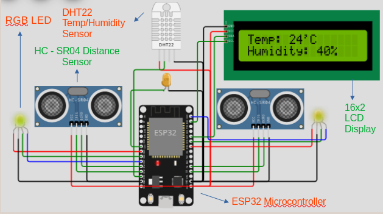
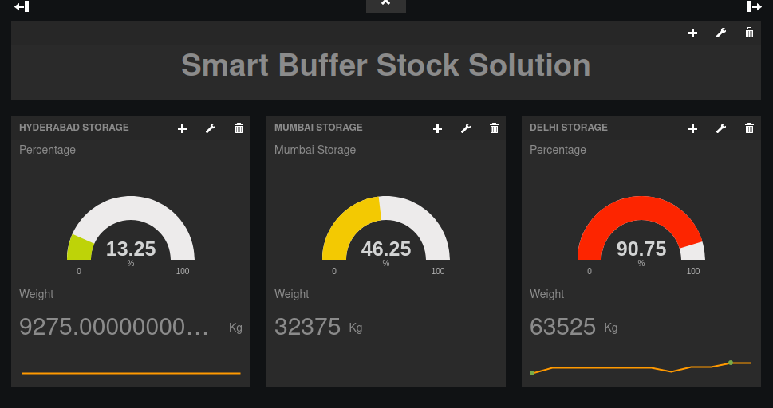
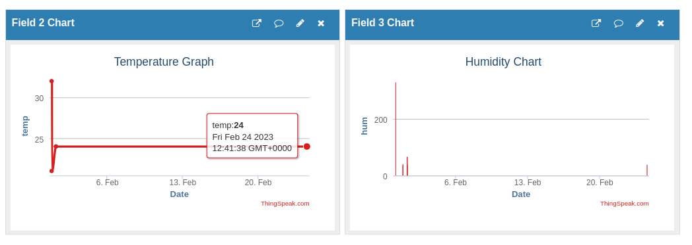
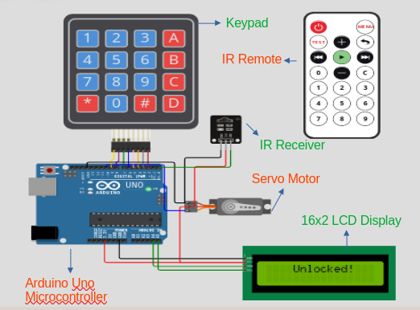

# Smart Buffer Stock Solution
This system is made as a solution to one of the problem statements (VM742) in the Smart India Hackathon  and is aimed to suppliment the growing investments of the Indian Government towards Buffer Stocks in India.
This system monitors the amount of capacity used in given Buffer Stocks at various locations on a dashboard. It also provides a rough estimate of the weight of the stocked food.  
This system has two modules namely an Analyzer module and a Security Module.
The Analyzer module is the main part that monitors the warehouse and uploads to a remote server. The security module is a basic PIN code based entry system to secure the premises.  
**Problem Statement Number: [VM742](https://sih.gov.in/sih2022PS)**  
**Links to Simulation:**
- **[Analyzer Module](https://wokwi.com/projects/355402968462510081)**
- **[Security Module](https://wokwi.com/projects/355401047886425089)**
### Requirements:
#### Analyzer Module:
- ESP32 Microcontroller
- HC-SR04 Ultrasonic Distance Sensor(s)
- RGB LED(s)
- A Wi-Fi Access Point
- A 3.3V Power Supply
- A 16x2 LCD Display
- [Freeboard.io](https://freeboard.io)
- [Thingspeak](https://thingspeak.com)
- [Dweet.io](https://dweet.io)
#### Security Module:
- A Keypad
- An Arduino Uno Microcontroller
- A Servo Motor
- A 16x2 LCD Display
- IR Remote and Receiver
### Description:
- Each buffer stock location must be equipped with a microcontroller such as an ESP32 along with an internet connection. The logic of the microcontroller can be found in [main_Logic.ino](https://codeberg.org/skran/Smart_Buffer_Stock_Solution/src/branch/main/main_Logic.ino).
- The microcontroller measures the sensor values and uploads it to [dweet.io](https://dweet.io) and [Thingspeak](https://Thingspeak.com).
- [Freeboard.io](https://freeboard.io) gets this data from dweet.io, applies calculations to obtain Percentage of capacity used, weight and outputs a nice dashboard.
- Thingspeak displays graphs directly from the received data.
- The configuration for Freeboard is in [dashboard.json](https://codeberg.org/skran/Smart_Buffer_Stock_Solution/src/branch/main/dashboard.json)
### Images:
#### Microcontroller Layout:  

#### Dashboard View (Freeboard.io):  

#### Dashboard View (Thingspeak):

#### Security Module:
